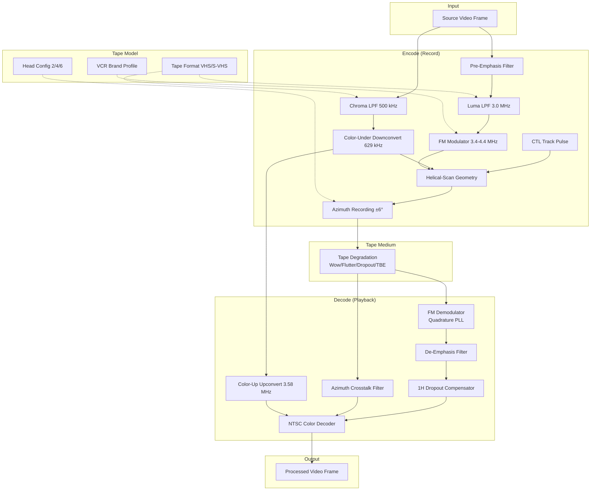

# VHS Helical-Scan Enhancement

Feature Name: vhs-helical-scan-enhancement
Updated: 2026-05-10

## Description

Enhance the NTSC VCR simulator to model true helical-scan VHS physics including brand-specific characteristics, configurable head counts, azimuth crosstalk rejection, FM luma encode/decode, color-under process, and CTL servo simulation. The simulation will produce visually authentic artifacts matching real VHS playback across different brands, head configurations, and tape formats (VHS/S-VHS).

## Architecture



## Components and Interfaces

### 1. VCR Brand Profile (`VCRBrandProfile`)

```cpp
struct VCRBrandProfile {
    const char* name;                    // "JVC HR-S3600", "Panasonic AG-1980", etc.

    // Drum mechanics
    float drum_bearing_resonance_hz;     // Primary resonant frequency (Sony: 30.5 Hz, others: 30.0 Hz)
    float drum_bearing_q;                // Q factor of bearing resonance
    float drum_eccentricity_base;        // Baseline drum wobble (μm)
    int   motor_pole_count;              // DC motor poles (Toshiba: 6, others: 8)

    // CTL system
    float ctl_head_sensitivity;          // Control head readout efficiency (0-1)
    float ctl_servo_bandwidth_hz;        // Servo loop bandwidth (Panasonic: 8 Hz, Sharp: 5 Hz)
    float ctl_pulse_width_us;            // CTL pulse width variation (μs)

    // Head amplifier
    float head_amp_noise_floor_db;       // Noise floor relative to signal (Sony: -52 dB, JVC: -48 dB)
    float head_amp_bandwidth_mhz;        // Head amp -3 dB point

    // Tape path
    float tape_path_length_mm;           // Total tape path length (Mitsubishi: longer)
    float scrape_flutter_coeff;          // Scrape flutter multiplier (longer path = more)
    float tape_tension_variation;        // Tape tension stability (0-1)

    // Head switch
    float head_switch_jitter_lines;      // Head switch position jitter (lines)
    float head_switch_transient_amplitude; // Switch transient magnitude
};
```

**Supported brands:**

| Parameter | JVC HR-S3600 | Panasonic AG-1980 | Sony SLV-1000 | Mitsubishi HS-HD2000U | Sharp VC-A588U | Toshiba M-462 |
|-----------|-------------|-------------------|---------------|----------------------|---------------|--------------|
| drum_bearing_resonance_hz | 30.0 | 30.0 | 30.5 | 30.0 | 30.0 | 30.0 |
| ctl_head_sensitivity | 0.85 | 0.95 | 0.80 | 0.88 | 0.70 | 0.82 |
| head_amp_noise_floor_db | -48 | -52 | -50 | -47 | -46 | -48 |
| motor_pole_count | 8 | 8 | 8 | 8 | 8 | 6 |
| scrape_flutter_coeff | 1.0 | 0.9 | 1.0 | 1.2 | 1.1 | 1.0 |
| head_switch_jitter_lines | 0.3 | 0.2 | 0.4 | 0.35 | 0.5 | 0.4 |

### 2. Head Configuration (`HeadConfig`)

```cpp
enum class HeadCount { TwoHead = 2, FourHead = 4, SixHead = 6 };

struct HeadConfig {
    HeadCount count;
    float azimuth_a_deg;               // +5.967° for standard A head
    float azimuth_b_deg;               // -5.967° for standard B head
    float head_gap_width_um;           // Video head gap width (~0.3 μm)
    float head_gap_depth_um;           // Video head gap depth (~0.5 μm)
    float head_switch_lines;           // Lines into VBI where switch occurs
    bool  has_hifi_heads;              // Dedicated Hi-Fi depth heads (6-head only)
    bool  has_eraser_head;             // Full-track eraser head (6-head only)
    bool  has_slowmo_heads;            // Dedicated still/slow-mo heads (4/6-head only)
};
```

### 3. FM Luma Processor (`FMLumaProcessor`)

```cpp
class FMLumaProcessor {
public:
    // Encode: Y → FM carrier
    void encode(const float* y_in, float* fm_out, int samples,
                float carrier_mhz, float deviation_mhz,
                float sample_rate_mhz);

    // Decode: FM carrier → Y
    void decode(const float* fm_in, float* y_out, int samples,
                float carrier_mhz, float deviation_mhz,
                float sample_rate_mhz, float signal_strength);

    // Bandwidth limiting
    void applyLumaLPF(float* signal, int samples, float cutoff_mhz, float sample_rate_mhz);

private:
    // Quadrature PLL demodulator state
    float pll_phase_;
    float pll_freq_;
    float pll_loop_filter_;

    // Pre-emphasis / de-emphasis
    float preemph_prev_;
    float deemph_prev_;

    // Butterworth LPF state (6-pole luma)
    float luma_biquad_[6][4];  // b0, b1, b2, a1, a2 per stage
};
```

**FM encode formula:**
```
f(t) = f_carrier + k_dev * Y(t)
where f_carrier = 3.4 MHz (sync tip), k_dev = 1.0 MHz, Y ∈ [0, 1]
peak white → 4.4 MHz, sync tip → 3.4 MHz
```

**FM decode (quadrature detector):**
```
I = FM(t) * cos(2π * f_carrier * t)
Q = FM(t) * sin(2π * f_carrier * t)
instantaneous_freq = atan2(Q, I) / (2π * dt)
Y_out = (instantaneous_freq - f_carrier) / k_dev
```

**FM threshold effect:**
```
if signal_strength_db < 12:
    sparkle_prob = exp((12 - signal_strength_db) * 0.5)
    output += sparkle_prob * random_impulse()
```

### 4. Color-Under Processor (`ColorUnderProcessor`)

```cpp
class ColorUnderProcessor {
public:
    // Encode: 3.58 MHz → 629 kHz
    void downconvert(float* i_in, float* q_in, float* i_under, float* q_under,
                     int samples, int line_num, float sample_rate_mhz);

    // Decode: 629 kHz → 3.58 MHz
    void upconvert(float* i_under, float* q_under, float* i_out, float* q_out,
                   int samples, int line_num, float sample_rate_mhz,
                   float adjacent_track_crosstalk);

    // Bandwidth limiting
    void applyChromaLPF(float* signal, int samples, float cutoff_mhz, float sample_rate_mhz);

private:
    // 3:2 phase switching state
    int phase_switch_state_;  // 0-3 (4-line cycle)

    // Butterworth LPF state (4-pole chroma)
    float chroma_biquad_[4][4];
};
```

**VHS 3:2 phase switching:**
```
Phase advances by 90° per line:
Line 0:   0°
Line 1:  90°
Line 2: 180°
Line 3: 270°
Line 4: 360° = 0° (repeats every 4 lines = 2 fields)
```

**Color-under crosstalk:**
```
I_adjacent = I_under * cos(180°) = -I_under  (phase-inverted)
Q_adjacent = Q_under * sin(180°) = -Q_under
```
This produces the characteristic cross-color moiré when azimuth rejection is incomplete.

### 5. Azimuth Rejection Filter (`AzimuthFilter`)

```cpp
class AzimuthFilter {
public:
    // Compute azimuth rejection at given frequency offset
    static float rejection_db(float freq_offset_hz, float gap_width_um = 0.3f,
                              float relative_velocity_ms = 4.86f,
                              float azimuth_angle_deg = 5.967f);

    // Apply azimuth filter to crosstalk signal
    void apply(float* crosstalk, int samples, float sample_rate_mhz,
               float head_gap_width_um);
};
```

**Azimuth rejection formula:**
```
rejection(f) = |sinc(π * f * d * sin(θ) / v)|
where:
  f = frequency offset from desired signal
  d = head gap width (0.3 μm)
  θ = azimuth angle (5.967°)
  v = head-to-tape relative velocity (4.86 m/s)

At luma FM carrier (1 MHz offset): ~30 dB rejection
At chroma-under (629 kHz): ~20 dB rejection
```

### 6. 1H Dropout Compensator (`DropoutCompensator`)

```cpp
class DropoutCompensator {
public:
    // Store current line for next frame's compensation
    void storeLine(const float* line_data, int samples);

    // Detect and compensate dropouts
    void process(float* signal, float* luma, float* chroma_i, float* chroma_q,
                 int samples, float dropout_threshold = 0.1f,
                 float compensation_strength = 0.8f);

private:
    std::vector<float> prev_line_;     // 1H delay buffer
    float compensation_strength_;      // 0 = raw, 1 = full compensation
};
```

### 7. CTL Track Model (`CTLTrackModel`)

```cpp
class CTLTrackModel {
public:
    // Generate CTL pulse for current field
    float generatePulse(float tape_position, float tracking_offset,
                        float tape_condition, float field_num);

    // Compute tracking lock from CTL signal
    float computeTrackingLock(float ctl_amplitude, float ctl_pulse_width);

    // Servo response: first-order LPF on drum phase error
    float servoResponse(float drum_phase_error, float wall_dt);

private:
    float ctl_pulse_amplitude_;
    float ctl_pulse_width_us_;
    float servo_phase_error_;
    float servo_time_constant_;        // 8-line time constant
};
```

**CTL pulse specification:**
```
Frequency: 59.94 Hz (one pulse per field)
Pulse width: 150 μs ± 20 μs
Amplitude: proportional to tape condition and tracking alignment
Position: tape edge (opposite side from audio track)
```

### 8. VHS Audio Simulator (`VHSAudioSimulator`)

The audio simulator replaces the CapstanVar dependency entirely. It generates authentic VHS audio from the same tape state that drives the video simulation.

```cpp
enum class VHSAudioFormat { MonoLinear, HiFiFM, Both };

struct VHSAudioOutput {
    std::vector<float> left_channel;   // 44.1 kHz or 48 kHz PCM
    std::vector<float> right_channel;  // Mono = left, stereo = Hi-Fi
    float sample_rate;
};

class VHSAudioSimulator {
public:
    // Initialize audio processors
    void init(int audio_sample_rate = 44100);

    // Process one frame's worth of audio, driven by tape state
    VHSAudioOutput processFrame(int num_samples,
                                 float tape_speed,
                                 float instant_speed,
                                 float wall_dt,
                                 float tape_time,
                                 float oxide_deg,
                                 float sticky_deg,
                                 float demag_deg,
                                 float tracking_deg,
                                 VHSAudioFormat format);

    // Feed source audio (optional: user can supply audio to be degraded)
    void setSourceAudio(const float* left, const float* right, int samples);

private:
    // Mono Linear AFM (Audio Frequency Modulation)
    struct LinearAFM {
        float fm_carrier_hz = 1300.0f;   // 1.3 kHz carrier
        float fm_deviation_hz = 400.0f;  // ±400 Hz deviation
        float bandwidth_hz = 10000.0f;   // 50 Hz - 10 kHz
        float wow_flutter_coeff = 0.15f; // wow/flutter intensity
        float hiss_level = 0.003f;       // tape hiss
        float dropout_rate = 0.0f;       // dropout click rate

        // FM encode/decode state
        float phase_accumulator;
        float prev_output;
        float wow_phase[3];
        float flutter_phase[4];
    };

    // Hi-Fi FM Audio (depth-multiplexed under video)
    struct HiFiFM {
        float carrier_left_hz = 1300000.0f;  // 1.3 MHz
        float carrier_right_hz = 1700000.0f; // 1.7 MHz
        float fm_deviation_hz = 150000.0f;   // ±150 kHz
        float bandwidth_hz = 20000.0f;       // 20 Hz - 20 kHz
        float video_crosstalk_db = -40.0f;   // FM video carrier leakage
        float noise_floor_db = -60.0f;       // Hi-Fi noise floor
        float wow_flutter_coeff = 0.05f;     // Less wow/flutter than linear

        // FM encode/decode state
        float phase_left;
        float phase_right;
        float prev_output_l;
        float prev_output_r;
    };

    LinearAFM linear_afm_;
    HiFiFM    hifi_fm_;

    // Source audio buffer (optional)
    std::vector<float> source_left_;
    std::vector<float> source_right_;
    int                source_sample_rate_;

    // Output buffer
    std::vector<float> out_left_;
    std::vector<float> out_right_;
};
```

**Linear AFM audio specification:**
```
Carrier frequency: 1.3 kHz (±400 Hz deviation)
Bandwidth: 50 Hz - 10 kHz (first-order LPF at 10 kHz)
Signal-to-noise: ~40 dB (new tape), degrades to ~25 dB (worn tape)
Wow: 0.3-2 Hz, up to ±3% speed variation
Flutter: 15-67 Hz, up to ±0.8% speed variation
Dropout clicks: random amplitude spikes, rate proportional to tape wear
```

**Hi-Fi FM audio specification:**
```
Left channel:  1.3 MHz carrier, ±150 kHz deviation
Right channel: 1.7 MHz carrier, ±150 kHz deviation
Bandwidth: 20 Hz - 20 kHz
Signal-to-noise: ~70 dB (new tape), degrades to ~50 dB (worn tape)
Dynamic range: 80 dB
Wow/flutter: minimal (tape speed variation shared with video, ±0.5%)
Video crosstalk: FM video carrier (3.4-4.4 MHz) leaks into Hi-Fi band at -40 dB
```

**Audio degradation model:**
```
linear_hiss = base_hiss * (1 + oxide_deg * 3.0 + sticky_deg * 2.0)
linear_wow = base_wow * (1 + demag_deg * 0.5)
linear_dropout_rate = base_rate * (1 + oxide_deg * 5.0 + sticky_deg * 3.0)

hifi_crosstalk = video_carrier_leakage * (1 + tracking_deg * 2.0)
hifi_noise = base_noise * (1 + oxide_deg * 1.5)
```

**Audio output timing:**
```
Audio samples generated per video frame = audio_sample_rate / 29.97
For 44.1 kHz: ~1472 samples per frame
For 48 kHz: ~1602 samples per frame
Tape speed variation modulates both pitch and sample count per frame
```

## Architecture (Updated)

```mermaid
graph TB
    subgraph "Input"
        SRC[Source Video Frame]
        SRC_AUD[Source Audio (optional)]
    end

    subgraph "Tape Model"
        BRAND[VCR Brand Profile]
        HEADS[Head Config 2/4/6]
        TAPE[Tape Format VHS/S-VHS]
    end

    subgraph "Encode (Record)"
        PREEMPH[Pre-Emphasis Filter]
        BWLUMA[Luma LPF 3.0/5.0 MHz]
        FM[FM Modulator 3.4-4.4 MHz]
        BWCHROMA[Chroma LPF 500/1000 kHz]
        COLORUNDER[Color-Under Downconvert 629 kHz]
        HELICAL[Helical-Scan Geometry]
        AZIMUTH[Azimuth Recording ±6°]
        CTL[CTL Track Pulse]
        AUD_L[Linear AFM Encode]
        AUD_H[Hi-Fi FM Encode]
    end

    subgraph "Tape Medium"
        DEGRA[Tape Degradation<br/>Wow/Flutter/Dropout/TBE]
    end

    subgraph "Decode (Playback)"
        DEMOD[FM Demodulator<br/>Quadrature PLL]
        DEEMPH[De-Emphasis Filter]
        COLORUP[Color-Up Upconvert 3.58 MHz]
        AZIMUTHRX[Azimuth Crosstalk Filter]
        DCOMP[1H Dropout Compensator]
        NTSC[NTSC Color Decoder]
        AUD_LD[Linear AFM Decode]
        AUD_HD[Hi-Fi FM Decode]
    end

    subgraph "Output"
        OUT[Processed Video Frame]
        OUT_AUD[PCM Audio Stream]
    end

    SRC --> PREEMPH
    SRC_AUD --> AUD_L
    SRC_AUD --> AUD_H
    BRAND -.-> FM
    HEADS -.-> AZIMUTH
    HEADS -.-> AUD_H
    TAPE -.-> BWLUMA
    TAPE -.-> BWCHROMA

    PREEMPH --> BWLUMA
    BWLUMA --> FM
    SRC --> BWCHROMA
    BWCHROMA --> COLORUNDER

    FM --> HELICAL
    COLORUNDER --> HELICAL
    AUD_L --> HELICAL
    AUD_H --> HELICAL
    CTL --> HELICAL
    HELICAL --> AZIMUTH
    AZIMUTH --> DEGRA
    DEGRA --> DEMOD
    DEMOD --> DEEMPH
    DEEMPH --> DCOMP
    COLORUNDER --> COLORUP
    COLORUP --> NTSC
    DEGRA --> AZIMUTHRX
    AZIMUTHRX --> NTSC
    DCOMP --> NTSC
    NTSC --> OUT
    DEGRA --> AUD_LD
    DEGRA --> AUD_HD
    AUD_LD --> OUT_AUD
    AUD_HD --> OUT_AUD
```

## Data Models

### Extended `NTSCSimulator` Members

```cpp
// New member variables
VCRBrandProfile    brand_profile_;
HeadConfig         head_config_;
FMLumaProcessor    fm_processor_;
ColorUnderProcessor color_processor_;
AzimuthFilter      azimuth_filter_;
DropoutCompensator dropout_comp_;
CTLTrackModel      ctl_model_;
VHSAudioSimulator  audio_simulator_;
TapeFormat         tape_format_;  // VHS or S-VHS

// FM processing buffers (per-scanline at ~14 MHz sample rate)
std::vector<float> fm_encode_buf_;
std::vector<float> fm_decode_buf_;

// 1H delay buffer
std::vector<float> prev_line_luma_buf_;
std::vector<float> prev_line_chroma_i_buf_;
std::vector<float> prev_line_chroma_q_buf_;

// Audio output buffer
VHSAudioOutput     audio_output_;
```

### Extended UI Parameters

```cpp
// In VideoParams or new VCRParams struct
struct VCRParams {
    int   brand_idx;           // 0=JVC, 1=Panasonic, 2=Sony, 3=Mitsubishi, 4=Sharp, 5=Toshiba
    int   head_count;          // 2, 4, or 6
    bool  s_vhs_mode;          // S-VHS vs VHS
    float dropout_compensation_strength; // 0-1
    float azimuth_crosstalk_level;       // 0-1 (override automatic calculation)
};
```

## Correctness Properties

### FM Encode/Decode Round-Trip
- **Invariant**: encode(decode(signal)) with zero noise and perfect alignment SHALL reproduce the original signal within 0.1% RMS error.
- **Test**: Feed a known luma pattern (ramp, step, sine) through encode → tape degradation → decode. Verify output matches expected FM-demodulated result.

### Azimuth Rejection
- **Invariant**: Adjacent-track crosstalk SHALL be attenuated by ≥ 25 dB at the luma FM carrier frequency.
- **Test**: Encode two adjacent tracks with orthogonal patterns. Decode one track with the other as crosstalk source. Measure crosstalk amplitude vs direct signal.

### Color-Under Phase Switching
- **Invariant**: The 4-line phase cycle SHALL repeat exactly every 4 lines (2 fields).
- **Test**: Verify chroma phase advances by exactly 90° per line over 8 consecutive lines.

### CTL Servo Lock
- **Invariant**: When CTL signal > 30% of nominal, tracking_lock_ SHALL converge to > 0.9 within 8 lines.
- **Test**: Inject a step change in CTL amplitude from 10% to 80%. Verify tracking_lock_ rises to > 0.9 within the specified time constant.

## Error Handling

| Scenario | Response |
|----------|----------|
| FM signal drops below threshold | Trigger sparkle noise, reduce output amplitude |
| CTL signal lost | tracking_lock_ decays exponentially, drum phase error accumulates |
| Tape format mismatch (S-VHS tape in VHS mode) | Warn user, fall back to VHS quality |
| Invalid head count | Default to 2-head, log warning |
| Brand profile not found | Default to JVC profile |

## Test Strategy

### Unit Tests
1. **FMLumaProcessor**: encode/decode round-trip with known input patterns
2. **ColorUnderProcessor**: downconvert/upconvert phase accuracy
3. **AzimuthFilter**: rejection dB at specified frequencies
4. **DropoutCompensator**: substitution accuracy with known patterns
5. **CTLTrackModel**: servo convergence timing

### Integration Tests
1. Full encode → tape degradation → decode pipeline with zero degradation → verify output matches input within tolerance
2. Brand differentiation: verify each brand produces distinct TBE pattern under identical input
3. Head count: verify 4-head and 6-head configurations reduce expected artifacts
4. S-VHS vs VHS: verify S-VHS produces wider bandwidth output with same input
5. Speed changes: verify chroma amplitude variation is uniform across scanline (no rainbow)

### Visual Tests
1. Compare simulated VHS output against real VHS captures of identical source material
2. Verify brand-specific artifacts match reference recordings
3. Verify azimuth crosstalk produces characteristic venetian blind pattern in LP/EP mode

## References

[^1]: VHS Specification - SMPTE standards for helical-scan recording
[^2]: NTSC Color Television Standards - EIA RS-170A
[^3]: `src/ntsc_simulator.cpp` - Current NTSC simulation implementation
[^4]: `src/ntsc_simulator.h` - Simulator class definition
[^5]: `src/constants.h` - Physical constants (drum RPM, FM carrier, azimuth angle)
[^6]: `src/processing_pipeline.cpp` - Pipeline thread, speed history
[^7]: `src/crt_tv.cpp` - TV preset system (reference for brand differentiation pattern)
[^8]: CapstanVar library - **REMOVED** - audio simulation now internal
[^9]: `src/audio_capture.cpp` - **REPLACED** - by VHSAudioSimulator
[^10]: `src/capture_thread.cpp` - **REPLACED** - by VHSAudioSimulator
